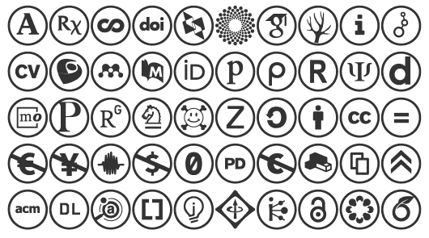

# Academmunicons: variable icon font for academics

**Academmunicons** is a specialist variable icon font family for academics. It contains icons for websites and organizations related to academia that are often missing from mainstream font packages. It can be used by itself, but its primary purpose is to be used as a supplementary package alongside a larger icon set.

<video autoplay loop controls style="max-width:530px; width:100%">
    <source src="./documentation/variable.mp4" type="video/mp4">
    
</video>

The font is available as a **Variable OpenType** TT font, where the **Weight** (`wght`) axis changes from **no border** to **reversed**, and the **Italic** (`ital`) axis switches between a **circular border** and a **rounded-square border**. Traditional OpenType TT fonts are also available.

The font is licensed under [OFL](./LICENSE.txt).

## Download

#### ➽ [DOWNLOAD](./dist/academmunicons-fonts-200415.zip) zipped OpenType fonts (variable and static)

_Version 200415_

## Glyph set

Unicodes:

Names:

You can access the glyphs with these PUA characters, or with special plain-text names, like `:academia:` (for no border), `:academia::` (for circular border) and `:academia:::` (for rounded-square border).

The “white” and “reversed” circular and rounded-square borders are also available as stylistic set OpenType features `ss01` to `ss04`.

| Char | HTML       | CSS     | plain-text        |
| ---- | ---------- | ------- | ----------------- |
|     | `&#xF041;` | `\F041` | `:academia:`      |
|     | `&#xF042;` | `\F042` | `:biorxiv:`       |
|     | `&#xF043;` | `\F043` | `:coursera:`      |
|     | `&#xF044;` | `\F044` | `:doi:`           |
|     | `&#xF045;` | `\F045` | `:dblp:`          |
|     | `&#xF046;` | `\F046` | `:figshare:`      |
|     | `&#xF047;` | `\F047` | `:googlescholar:` |
|     | `&#xF048;` | `\F048` | `:dryad:`         |
|     | `&#xF049;` | `\F049` | `:impactstory:`   |
|     | `&#xF04A;` | `\F04A` | `:dataverse:`     |
|     | `&#xF04B;` | `\F04B` | `:cv:`            |
|     | `&#xF04C;` | `\F04C` | `:lattes:`        |
|     | `&#xF04D;` | `\F04D` | `:mendeley:`      |
|     | `&#xF04E;` | `\F04E` | `:pubmed:`        |
|     | `&#xF04F;` | `\F04F` | `:orcid:`         |
|     | `&#xF050;` | `\F050` | `:publons:`       |
|     | `&#xF051;` | `\F051` | `:piazza:`        |
|     | `&#xF052;` | `\F052` | `:researcherid:`  |
|     | `&#xF053;` | `\F053` | `:scirate:`       |
|     | `&#xF054;` | `\F054` | `:depsy:`         |
|     | `&#xF055;` | `\F055` | `:mathoverflow:`  |
|     | `&#xF056;` | `\F056` | `:philpapers:`    |
|     | `&#xF057;` | `\F057` | `:researchgate:`  |
|     | `&#xF058;` | `\F058` | `:springer:`      |
|     | `&#xF059;` | `\F059` | `:arxiv:`         |
|     | `&#xF05A;` | `\F05A` | `:zotero:`        |
|     | `&#xF061;` | `\F061` | `:ccsa:`          |
|     | `&#xF062;` | `\F062` | `:ccby:`          |
|     | `&#xF063;` | `\F063` | `:cccc:`          |
|     | `&#xF064;` | `\F064` | `:ccnd:`          |
|     | `&#xF065;` | `\F065` | `:ccnceu:`        |
|     | `&#xF06A;` | `\F06A` | `:ccncjp:`        |
|     | `&#xF06D;` | `\F06D` | `:ccsampling:`    |
|     | `&#xF06E;` | `\F06E` | `:ccnc:`          |
|     | `&#xF06F;` | `\F06F` | `:cczero:`        |
|     | `&#xF070;` | `\F070` | `:ccpd:`          |
|     | `&#xF071;` | `\F071` | `:ccpdalt:`       |
|     | `&#xF072;` | `\F072` | `:ccremix:`       |
|     | `&#xF073;` | `\F073` | `:ccshare:`       |
|     | `&#xF0C0;` | `\F0C0` | `:acclaim:`       |
|     | `&#xF0C1;` | `\F0C1` | `:acm:`           |
|     | `&#xF0C2;` | `\F0C2` | `:acmdl:`         |
|     | `&#xF0C3;` | `\F0C3` | `:ads:`           |
|     | `&#xF0C7;` | `\F0C7` | `:ceur:`          |
|     | `&#xF0CC;` | `\F0CC` | `:ideasrepec:`    |
|     | `&#xF0CD;` | `\F0CD` | `:ieee:`          |
|     | `&#xF0CE;` | `\F0CE` | `:inspire:`       |
|     | `&#xF0D2;` | `\F0D2` | `:openaccess:`    |
|     | `&#xF0D3;` | `\F0D3` | `:osf:`           |
|     | `&#xF0D4;` | `\F0D4` | `:overleaf:`      |

## Background

The font **Academmunicons** was manufactured in **[FontLab 7](http://fontlab.info)** by Adam Twardoch.

- Website: [https://twardoch.github.io/academmunicons-font/](https://twardoch.github.io/academmunicons-font/)
- Github repo: [https://github.com/twardoch/academmunicons-font](https://github.com/twardoch/academmunicons-font)
- The FontLab 7 source file (VFJ) is in the [`sources`](./sources/) folder. See [LICENSE.txt](./LICENSE.txt) for licensing details.
- Based on the [Academicons](https://jpswalsh.github.io/academicons/) font by James Walsh and Katja Bercic, licensed under the [SIL Open Font License, Version 1.1](http://scripts.sil.org/OFL).
- Based on the [Creative Commons icons](https://cc-icons.github.io/) font by Creative Commons, designed by Ricardo Barros, licensed under the [CC-BY-4.0 International license](https://creativecommons.org/licenses/by/4.0/).
- The glyphs may depict trademarks or registered trademarks by the respective owners.
